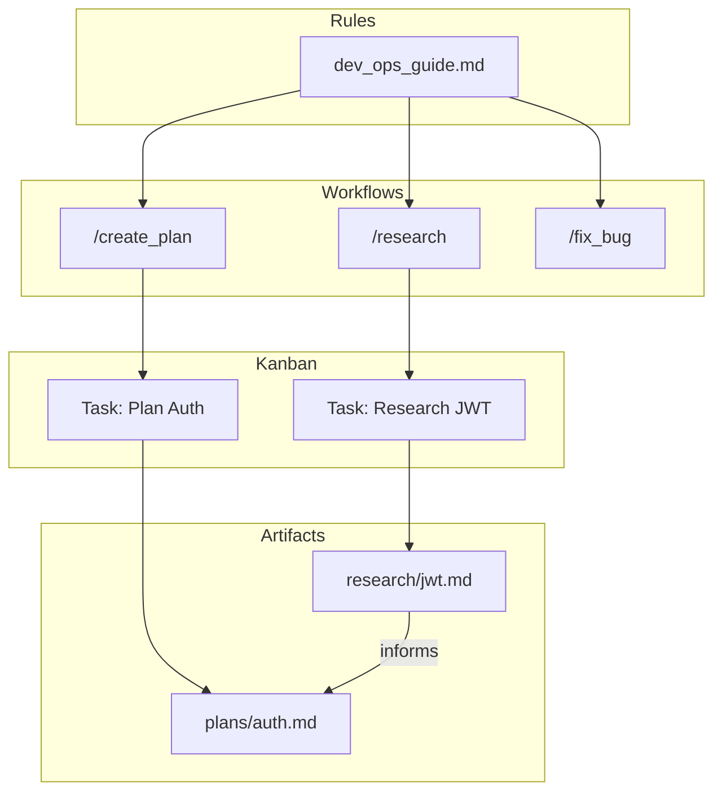
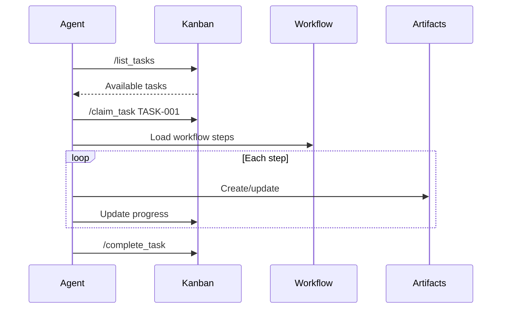

# DevOps Framework

A comprehensive development framework that creates an efficient, truly
collaborative environment for **human teams and AI agents** working together.

> **Note**: This framework is designed for use with
> [Antigravity IDE](https://antigravity.dev) — the AI-native development
> environment.

## Overview

DevOps Framework follows a **task-centric model**:

- **Everything is a Task** — All work lives on the Kanban board
- **Workflows = Pre-decomposed Tasks** — Step sequences with automation
- **Artifacts are Linked** — All outputs in `dev_ops/`, linked to tasks
- **Automation First** — Python scripts reduce agent token usage

## Architecture



## Installation

### 1. Install the Extension

Install the `dev-ops-X.X.X.vsix` from this repository:

1. Open Antigravity IDE
2. Press `Ctrl+Shift+P` → **Extensions: Install from VSIX...**
3. Select the `.vsix` file from `extension/dev-ops-X.X.X.vsix`

### 2. Initialize Your Project

1. Open your project folder
2. Press `Ctrl+Shift+P` → **DevOps: Initialize**
3. This creates:
   - `.agent/rules/` — Agent behavior rules
   - `.agent/workflows/` — Slash command definitions
   - `dev_ops/kanban/` — Task board
   - `dev_ops/scripts/` — Automation scripts

## How It Works

### Agent Workflow



### For Humans

Type `/command` in the Antigravity chat to trigger workflows:

```text
/create_plan   → Create an implementation plan
/research      → Start a research document
/fix_bug       → Fix a tracked bug
```

### For AI Agents

The agent automatically reads rules from `.agent/rules/` and follows project
standards. Rules define:

- Code style and conventions
- Workflow procedures
- Quality requirements

## Available Commands

### Task Management

| Command | Description |
|---------|-------------|
| `/add_task` | Add a new task to the backlog |
| `/create_task` | Create a detailed task with context |
| `/pick_task` | Pick the next task to work on |
| `/claim_task` | Claim a task as yours |
| `/complete_task` | Mark a task as complete |
| `/list_tasks` | Show all tasks in the board |

### Planning & Development

| Command | Description |
|---------|-------------|
| `/bootstrap` | Initialize DevOps in a new project |
| `/create_plan` | Create an implementation plan |
| `/implement_plan` | Execute an implementation plan |
| `/create_feature` | Create a new feature with full workflow |
| `/brainstorm` | Start a brainstorming session |

### Quality & Review

| Command | Description |
|---------|-------------|
| `/debug` | Start a debugging session |
| `/fix_bug` | Fix a reported bug |
| `/fix_build` | Fix build/CI failures |
| `/audit_code` | Audit code for issues |
| `/verify` | Verify implementation correctness |

### Documentation

| Command | Description |
|---------|-------------|
| `/research` | Create a research document |
| `/create_adr` | Create an Architecture Decision Record |
| `/supersede_adr` | Supersede an existing ADR |
| `/report_bug` | Create a bug report |
| `/link_artifact` | Link artifacts to tasks |

### Git & PRs

| Command | Description |
|---------|-------------|
| `/create_commit` | Create a well-formatted commit |
| `/create_pr` | Create a pull request |
| `/check_pr` | Review a pull request |
| `/triage_feedback` | Triage PR feedback |

## Project Structure

```text
your-project/
├── .agent/
│   ├── rules/
│   │   └── dev_ops_guide.md   # Agent behavior rules
│   └── workflows/             # Slash command definitions
└── dev_ops/
    ├── scripts/               # Automation scripts
    ├── kanban/
    │   └── board.json         # Task board
    ├── plans/                 # Implementation plans
    ├── research/              # Research documents
    └── adrs/                  # Architecture Decision Records
```

## Development

To modify the framework or extension:

```bash
cd extension
pnpm install
pnpm run compile
npx @vscode/vsce package --no-dependencies
```

## Acknowledgments

This project includes software from:

- **[Titan Kanban](https://github.com/MissTitanK3/titan-kanban)** by MissTitanK3
  (MIT License)

See [THIRD_PARTY_LICENSES.md](THIRD_PARTY_LICENSES.md) for details.

## License

MIT License — see [LICENSE](LICENSE) for details.
