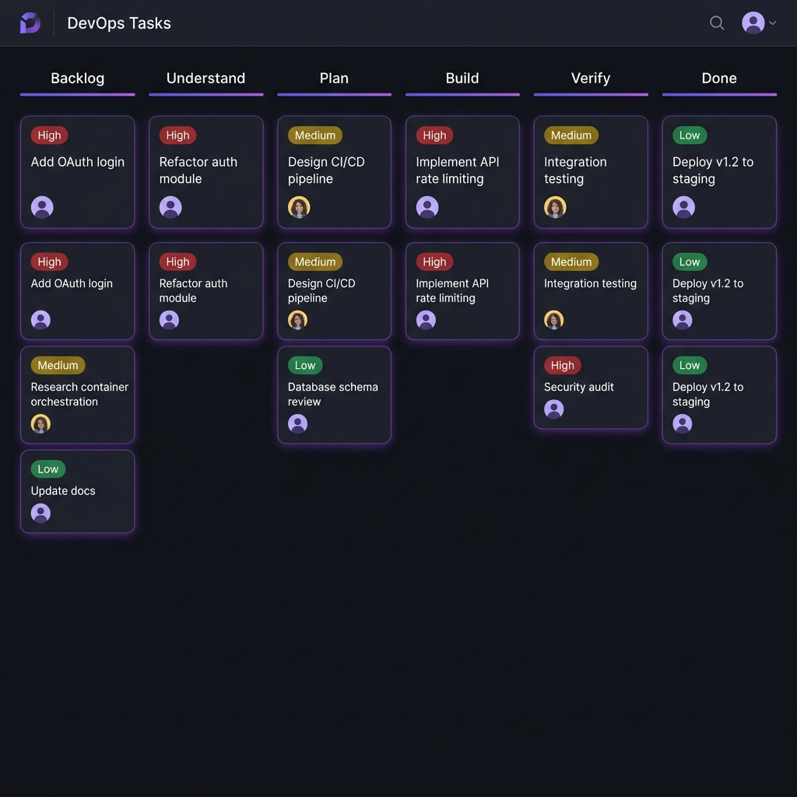

<p align="center">
  
</p>

# DevOps Framework

**AI-native development with structured phases, skills, and workflows**

[](https://github.com/NunoMoura/dev_ops/actions/workflows/ci.yml)

---

## What is DevOps?

A **lightweight framework** for developers using AI coding agents (Cursor, Antigravity). It provides:

- **Structured phases** for task progression (Backlog → Understand → Plan → Build → Verify → Done)
- **Skills** that teach agents phase-specific behaviors
- **Workflows** for common operations (slash commands)
- **Templates** for consistent documentation

**Best for**: AI-assisted development with Cursor or Antigravity IDE.

<p align="center">
  
  <br />
  <em>Task board with 6-phase workflow</em>
</p>

---

## Quick Start

```bash
# 1. Install extension in your IDE
cursor --install-extension dev-ops.vsix
# or: antigravity --install-extension dev-ops.vsix

# 2. Open project and initialize
# Cmd/Ctrl+Shift+P → "DevOps: Initialize"

# 3. Run bootstrap to analyze project
/bootstrap
```

---

## Phase Flow

Every task moves through a **6-phase workflow**:

```markdown
┌─────────┬───────────┬──────┬───────┬────────┬──────┐
│ Backlog │ Understand│ Plan │ Build │ Verify │ Done │
└─────────┴───────────┴──────┴───────┴────────┴──────┘
```

| Phase | Purpose | Skill |
|-------|---------|-------|
| **Backlog** | Claim task, read context | `backlog_phase` |
| **Understand** | Research, scope, align | `understand_phase` |
| **Plan** | Create implementation plan | `plan_phase` |
| **Build** | TDD implementation | `build_phase` |
| **Verify** | Test, document, PR | `verify_phase` |

---

## Skills

Skills are **detailed instructions** that guide agents through each phase. Located in `.agent/skills/`.

### Phase Skills

| Skill | Description | Key Output |
|-------|-------------|------------|
| `backlog_phase` | Claim a task from backlog and understand context | Task ownership |
| `understand_phase` | Deep research before planning | RES-XXX research doc |
| `plan_phase` | Create detailed implementation plan | PLN-XXX plan doc |
| `build_phase` | TDD implementation with tests first | Production-ready code |
| `verify_phase` | Validate, document proof, ship PR | Walkthrough + PR |

### Using Skills

Agents automatically activate skills based on task phase. Each skill contains:

```markdown
.agent/skills/<phase>_phase/
├── SKILL.md         # Detailed instructions
└── examples/        # Reference implementations
```

To manually reference a skill:

```bash
view_file .agent/skills/understand_phase/SKILL.md
```

---

## Workflows

Workflows are **slash commands** for common operations. Located in `.agent/workflows/`.

### Available Workflows

| Command | Description | Category |
|---------|-------------|----------|
| `/bootstrap` | Analyze project, generate tasks and rules | Setup |
| `/claim` | Claim task from backlog | Task |
| `/create_task` | Create a new task | Task |
| `/add_feature` | Create feature spec and decompose to tasks | Planning |
| `/report_bug` | Create bug report | Planning |
| `/explain` | Explain project, component, or code | Research |
| `/refine_phase` | Generate refinement prompt with feedback | Iteration |
| `/retry_phase` | Re-run phase with same context | Iteration |
| `/triage_comment` | Analyze and act on PR comment | Review |
| `/add_mcp` | Add MCP server to skill phase | Extension |

### Workflow Examples

**Start working on a project:**

```bash
/bootstrap                    # Analyze and generate task backlog
/claim                        # Pick highest priority task
# Agent follows phase flow automatically
```

**Add new work:**

```bash
/add_feature "User dashboard"  # Creates FEAT-XXX, decomposes to tasks
/report_bug "Login timeout"    # Creates BUG-XXX for tracking
/create_task "Refactor auth"   # Direct task creation
```

**Iterate on agent work:**

```bash
/refine_phase "Also handle edge case X"  # Add feedback to current work
/retry_phase                              # Restart phase with same context
```

---

## Templates

Templates ensure consistent documentation. Located in `.dev_ops/templates/`.

### Artifact Templates (Ephemeral)

| Template | Purpose | Created By |
|----------|---------|------------|
| `research.md` | Research findings | Understand phase |
| `plan.md` | Implementation plan | Plan phase |
| `pr.md` | Pull request description | Verify phase |
| `task.md` | Task structure | `/create_task` |
| `bug.md` | Bug report format | `/report_bug` |

### Doc Templates (Persistent)

| Template | Purpose | Created By |
|----------|---------|------------|
| `prd.md` | Product requirements | Bootstrap (if missing) |
| `nonnegotiables.md` | Project constraints | Bootstrap (if missing) |
| `architecture_doc.md` | Component documentation | Bootstrap scaffold |
| `story.md` | User story format | `/add_feature` |
| `user.md` | User persona | `/add_feature` |
| `mockup.md` | UI mockup documentation | `/add_feature` |

---

## Project Structure

After initialization:

```markdown
your-project/
├── .agent/                    # Agent configuration
│   ├── rules/                 # Always-on behavioral rules
│   │   └── dev_ops_guide.md   # Core framework guide
│   ├── skills/                # Phase-specific instructions
│   │   ├── backlog_phase/
│   │   ├── understand_phase/
│   │   ├── plan_phase/
│   │   ├── build_phase/
│   │   └── verify_phase/
│   └── workflows/             # Slash commands
│       ├── bootstrap.md
│       ├── claim.md
│       └── ...
└── .dev_ops/                  # DevOps data
    ├── board.json             # Task board state
    ├── scripts/               # CLI tools
    ├── templates/             # Document templates
    ├── docs/                  # Project documentation
    │   ├── prd.md
    │   ├── nonnegotiables.md
    │   └── architecture/
    └── archive/               # Completed task archives
```

---

## The Dev Cycle

### 1. Initialize Project

```bash
/bootstrap
```

Analyzes your project:

- Detects tech stack (languages, frameworks, linters)
- Creates tasks for missing docs (PRD, Non-Negotiables)
- Generates rules for detected technologies
- Scaffolds architecture documentation

### 2. Work on Tasks

```bash
/claim TASK-001  # Or just /claim for highest priority
```

Agent follows phase flow:

1. **Backlog** → Read trigger doc, understand context
2. **Understand** → Research, create RES-XXX
3. **Plan** → Design solution, create PLN-XXX
4. **Build** → TDD implementation
5. **Verify** → Test, create walkthrough, PR

### 3. Iterate

```bash
/refine_phase "Add error handling for edge case"
```

Agent updates work based on feedback.

### 4. Review & Merge

Agent creates PR with:

- Summary of changes
- Link to walkthrough
- Test results

---

## Core Rules

The framework enforces key principles via `.agent/rules/dev_ops_guide.md`:

- **Quality over speed** — Understand before you build
- **One session = one phase** — End at exit criteria, user triggers next
- **Tasks = pointers** — Reference docs, don't duplicate them
- **Check non-negotiables** — Verify alignment before major changes

---

## CLI Reference

All operations available via Python CLI:

```bash
# Task operations
python3 .dev_ops/scripts/board_ops.py create_task --title "..." --priority high --commit
python3 .dev_ops/scripts/board_ops.py move TASK-001 col-plan --commit
python3 .dev_ops/scripts/board_ops.py list --column col-backlog

# Artifact operations
python3 .dev_ops/scripts/artifact_ops.py create research --title "..." --task TASK-001
python3 .dev_ops/scripts/artifact_ops.py list

# Project operations
python3 .dev_ops/scripts/project_ops.py detect --target . --format json
python3 .dev_ops/scripts/project_ops.py generate-rules --target .
```

---

## Configuration

### Settings

```json
{
  "devops.pythonPath": "/usr/local/bin/python3",
  "devops.autoOpenBoard": true
}
```

### Custom Rules

Add project-specific rules to `.agent/rules/`:

```markdown
---
activation_mode: Always On
description: Project coding standards
---

# Coding Standards

- Use type hints for all functions
- Maximum 100 lines per file
- All new code requires tests
```

---

## Development

### Build Extension

```bash
cd extension
npm install
npm run compile         # Dev build
npm run package         # Production VSIX
```

### Run Tests

```bash
# Python
pytest tests/ --cov=scripts

# TypeScript
cd extension && npm test
```

---

## License

MIT License - see [LICENSE](./LICENSE)
