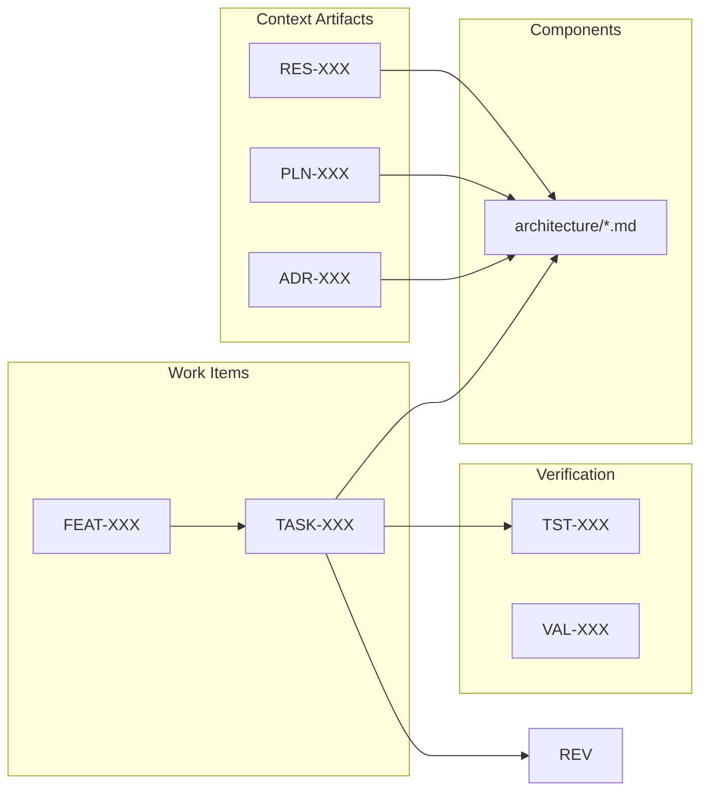
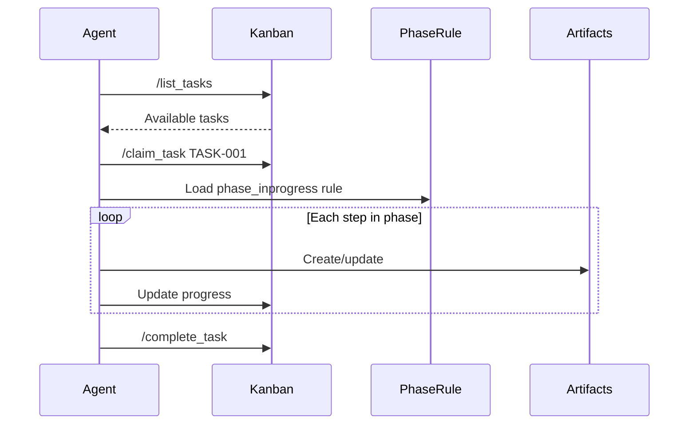

# DevOps Framework

[](https://github.com/NunoMoura/dev_ops/actions/workflows/ci.yml)
[](https://codecov.io/gh/NunoMoura/dev_ops)

A comprehensive development framework that creates an efficient, truly
collaborative environment for **human teams and AI agents** working together.

> **Note**: This framework is designed for use with
> [Antigravity IDE](https://antigravity.dev) — the AI-native development
> environment.

## Overview

DevOps Framework follows a **component-centric model**:

> **Components are permanent. Tasks are transient. Artifacts serve components.**

- **Components** — Architecture docs that mirror your `src/` folder hierarchy
- **Tasks** — Work items that create or modify components
- **Artifacts** — Context (Research, Plans, ADRs) or verification (Tests, Reviews)
- **Features** — Optional, only for user-facing changes

```text
Component (mirrors src/ hierarchy)
├── Context: Research, Plans, ADRs
├── Implementation: Tasks that built it
├── Verification: Tests, Reviews
└── Code: src/...
```

## The Component Model

### Why Components?

Traditional approaches organize by artifact type (plans/, research/, tests/).
This scatters related information across folders.

**Component-centric** organizes by *what the artifact describes*:

```text
architecture/
├── domain/
│   ├── users/
│   │   ├── auth.md        ← Everything about auth
│   │   └── profile.md     ← Everything about profile
│   └── orders/
└── infrastructure/
```

Each component doc links to:

- Research that informed it
- Plans that guided it
- Tasks that built it
- Tests that verify it

### The Hierarchy

Architecture docs mirror your codebase structure:

| Code Path | Architecture Doc |
|-----------|-----------------|
| `src/` | `architecture/README.md` |
| `src/domain/` | `architecture/domain/README.md` |
| `src/domain/users/auth/` | `architecture/domain/users/auth.md` |

**Higher levels = broader concerns.** Navigate up to zoom out, down to dive in.

### Work Flow



1. **User creates work** → Task or Feature
2. **Agent gathers context** → Research, Plans, ADRs (linked to component)
3. **Agent implements** → Creates/modifies component
4. **Agent verifies** → Tests, Reviews (linked to component)
5. **Component doc accumulates** → Full history of what built it

## Installation

### 1. Install the Extension

Install the `dev-ops-X.X.X.vsix` from this repository:

1. Open Antigravity IDE
2. Press `Ctrl+Shift+P` → **Extensions: Install from VSIX...**
3. Select the `.vsix` file from `extension/dev-ops-X.X.X.vsix`

### 2. Initialize Your Project

1. Open your project folder
2. Press `Ctrl+Shift+P` → **DevOps: Initialize**
3. This creates:
   - `.agent/rules/` — Agent behavior rules
   - `.agent/workflows/` — Slash command definitions
   - `dev_ops/kanban/` — Task board
   - `dev_ops/scripts/` — Automation scripts

## Extension Features (v0.6.0)

### Board Templates

When you run `DevOps: Initialize`, you can choose from:

| Template | Description |
|----------|-------------|
| **Empty Board** | Start with a blank Kanban board |
| **Greenfield** | New project: vision, tech stack, architecture, CI/CD |
| **Brownfield** | Existing code: audit, dependencies, tests, docs |

### Kanban Board

- **Visual Board** — Drag-and-drop task management
- **Task Editor Tabs** — Double-click a task to edit in a full editor tab
- **Metrics Dashboard** — Sidebar shows board metrics and Onboard Agent button
- **Auto-save** — Edits save automatically

### Agent CLI Commands

```bash
# Checklist management for complex tasks
python scripts/kanban_ops.py checklist add TASK-001 "Step to complete"
python scripts/kanban_ops.py checklist complete TASK-001 0
python scripts/kanban_ops.py checklist list TASK-001

# Split complex task into simpler ones
python scripts/kanban_ops.py replace TASK-001 --with "Task A" "Task B" "Task C"
```

## How It Works

### Mental Model

```text
┌─────────────────────────────────────────────────────────┐
│  USER (Project Manager)                                 │
│  8 Commands: /create_task, /list_tasks, /pick_task,     │
│              /claim_task, /complete_task, /report_bug,  │
│              /triage_feedback, /bootstrap               │
│  → Manages WHAT gets done and WHEN                      │
└─────────────────────────┬───────────────────────────────┘
                          │ Kanban Board
                          ▼
┌─────────────────────────────────────────────────────────┐
│  AGENT (Expert Developer)                               │
│  Guided by: phase_* rules                               │
│  → Executes HOW the work gets done                      │
└─────────────────────────────────────────────────────────┘
```

### Agent Workflow



## Available Commands

### User Workflows (Slash Commands)

| Command | Description |
|---------|-------------|
| `/bootstrap` | Initialize DevOps in a project |
| `/create_prd` | Create a Product Requirements Document |
| `/create_constitution` | Create project constitution from PRD |
| `/add_feature` | Add a feature → decompose to tasks |
| `/create_task` | Add a new task to the backlog |
| `/spawn_agent` | Pick the next available task |
| `/report_bug` | Report a new bug |
| `/next_phase` | Move task to next phase |
| `/retry_phase` | Re-attempt current phase |
| `/refine_phase` | Refine current phase work |
| `/triage_comment` | Process PR comments |

### Agent-Guided Procedures (Phase Rules)

Development procedures are **not** commands — they are guided by phase rules
based on the task's current column:

| Column | Phase Rule | What Agent Does |
|--------|------------|-----------------|
| Backlog | `1_backlog` | Claim task, review trigger |
| Understand | `2_understand` | Research, create RES-XXX, update docs |
| Plan | `3_plan` | Create PLN-XXX with checklist |
| Build | `4_build` | TDD workflow, implement code |
| Verify | `5_verify` | Quality gates, PR, archive |

## Project Structure

```text
your-project/
├── .agent/
│   ├── rules/
│   │   ├── dev_ops_guide.md     # Framework overview (Always On)
│   │   ├── 1_backlog.md         # Backlog phase
│   │   ├── 2_understand.md      # Understand phase
│   │   ├── 3_plan.md            # Plan phase
│   │   ├── 4_build.md           # Build phase
│   │   └── 5_verify.md          # Verify phase
│   └── workflows/               # User commands
└── dev_ops/
    ├── board.json               # Task board (flattened)
    ├── docs/                    # Persistent documentation
    │   ├── architecture/        # Component docs, ADRs
    │   ├── features/            # Feature specs
    │   ├── prds/                # Product requirements
    │   ├── tests/               # Test documentation
    │   └── research/            # Research (supports ADRs)
    ├── artifacts/               # Ephemeral artifacts
    │   ├── plans/               # PLN-XXX
    │   ├── validation_reports/  # VAL-XXX
    │   ├── bugs/                # BUG-XXX
    │   └── archive/             # Archived TASK-XXX.tar.gz
    ├── scripts/                 # Automation scripts
    └── templates/               # Document templates
```

## Development

To modify the framework or extension:

```bash
cd extension
pnpm install
pnpm run compile
npx @vscode/vsce package --no-dependencies
```

## Acknowledgments

This project includes software from:

- **[Titan Kanban](https://github.com/MissTitanK3/titan-kanban)** by MissTitanK3
  (MIT License)

See [THIRD_PARTY_LICENSES.md](THIRD_PARTY_LICENSES.md) for details.

## License

MIT License — see [LICENSE](LICENSE) for details.
