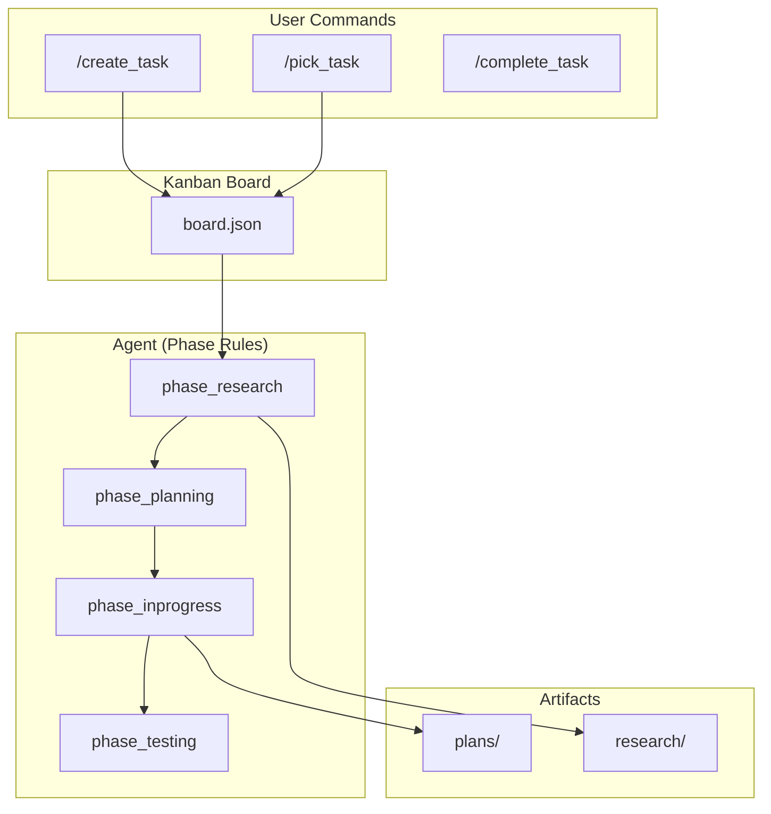
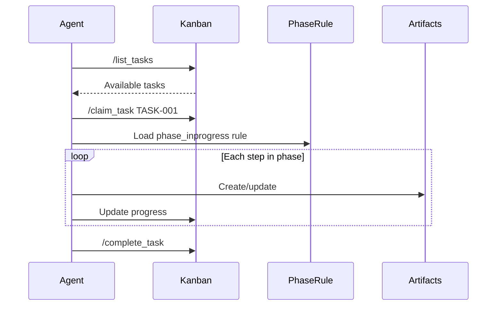

# DevOps Framework

A comprehensive development framework that creates an efficient, truly
collaborative environment for **human teams and AI agents** working together.

> **Note**: This framework is designed for use with
> [Antigravity IDE](https://antigravity.dev) — the AI-native development
> environment.

## Overview

DevOps Framework follows a **task-centric model**:

- **Everything is a Task** — All work lives on the Kanban board
- **Users are Project Managers** — Manage the board with simple commands
- **Agents are Expert Developers** — Execute work guided by phase rules
- **Artifacts are Linked** — All outputs in `dev_ops/`, linked to tasks
- **Automation First** — Python scripts reduce agent token usage

## Architecture



## Installation

### 1. Install the Extension

Install the `dev-ops-X.X.X.vsix` from this repository:

1. Open Antigravity IDE
2. Press `Ctrl+Shift+P` → **Extensions: Install from VSIX...**
3. Select the `.vsix` file from `extension/dev-ops-X.X.X.vsix`

### 2. Initialize Your Project

1. Open your project folder
2. Press `Ctrl+Shift+P` → **DevOps: Initialize**
3. This creates:
   - `.agent/rules/` — Agent behavior rules
   - `.agent/workflows/` — Slash command definitions
   - `dev_ops/kanban/` — Task board
   - `dev_ops/scripts/` — Automation scripts

## How It Works

### Mental Model

```text
┌─────────────────────────────────────────────────────────┐
│  USER (Project Manager)                                 │
│  8 Commands: /create_task, /list_tasks, /pick_task,     │
│              /claim_task, /complete_task, /report_bug,  │
│              /triage_feedback, /bootstrap               │
│  → Manages WHAT gets done and WHEN                      │
└─────────────────────────┬───────────────────────────────┘
                          │ Kanban Board
                          ▼
┌─────────────────────────────────────────────────────────┐
│  AGENT (Expert Developer)                               │
│  Guided by: phase_* rules                               │
│  → Executes HOW the work gets done                      │
└─────────────────────────────────────────────────────────┘
```

### Agent Workflow



## Available Commands

### Board Management (User Commands)

| Command | Description |
|---------|-------------|
| `/create_task` | Add a new task to the backlog |
| `/list_tasks` | View all tasks on the board |
| `/pick_task` | Pick the next available task |
| `/claim_task` | Claim a task as yours |
| `/complete_task` | Mark a task as complete |
| `/report_bug` | Report a new bug |
| `/triage_feedback` | Process PR feedback into tasks |
| `/bootstrap` | Initialize DevOps in a project |

### Agent-Guided Procedures (Phase Rules)

Development procedures are **not** commands — they are guided by phase rules
based on the task's current column:

| Column | Phase Rule | What Agent Does |
|--------|------------|-----------------|
| Backlog | `phase_backlog` | Brainstorm, prioritize |
| Research | `phase_research` | Investigate, create RES-XXX, ADR-XXX |
| Planning | `phase_planning` | Create PLN-XXX |
| In Progress | `phase_inprogress` | Implement, debug, commit |
| Testing | `phase_testing` | Run tests, create TST-XXX |
| Done | `phase_done` | Create PR |

## Project Structure

```text
your-project/
├── .agent/
│   ├── rules/
│   │   ├── dev_ops_guide.md     # Framework overview
│   │   ├── phase_backlog.md     # Backlog phase
│   │   ├── phase_research.md    # Research phase
│   │   ├── phase_planning.md    # Planning phase
│   │   ├── phase_inprogress.md  # Implementation phase
│   │   ├── phase_testing.md     # Testing phase
│   │   ├── phase_done.md        # Completion phase
│   │   └── phase_blocked.md     # Blocked handling
│   └── workflows/               # User commands (8 files)
└── dev_ops/
    ├── scripts/                 # Automation scripts
    ├── kanban/
    │   └── board.json           # Task board
    ├── plans/                   # PLN-XXX artifacts
    ├── research/                # RES-XXX artifacts
    ├── tests/                   # TST-XXX artifacts
    ├── bugs/                    # BUG-XXX artifacts
    └── adrs/                    # ADR-XXX artifacts
```

## Development

To modify the framework or extension:

```bash
cd extension
pnpm install
pnpm run compile
npx @vscode/vsce package --no-dependencies
```

## Acknowledgments

This project includes software from:

- **[Titan Kanban](https://github.com/MissTitanK3/titan-kanban)** by MissTitanK3
  (MIT License)

See [THIRD_PARTY_LICENSES.md](THIRD_PARTY_LICENSES.md) for details.

## License

MIT License — see [LICENSE](LICENSE) for details.
