# Dev_Ops Framework

**An Agentic Framework for High-Quality Software Development.**

The `dev_ops` framework is a collection of tools, workflows, and conventions designed to bridge the gap between **Human Developers** and **AI Agents**.

---

## 🔁 The Hybrid Model

This framework treats software development as a collaborative "Hybrid" process.

### 🧑‍💻 The User (The Pilot)

You are the pilot. You have the `Intention` and make the `Decisions`.

- **Trigger**: You initiate work via **Slash Commands** (e.g., `/bug`, `/plan`) or by entering natural language prompts.
- **Review**: You approve Plans, ADRs, and Code changes.

### 🤖 The Agent (The Co-Pilot)

The AI is your co-pilot. It handles the `Execution` and `Validation`.

- **Context**: It automatically loads `rules/` relevant to the active file.
- **Workflow**: It follows deterministic `workflows/` to complete tasks (e.g., "Create a Plan", "Fix a Bug").
- **Tools**: It uses python scripts (`scripts/`) to perform atomic actions like generating IDs or logging bugs.

---

## 🌊 Document Relationships

```mermaid
flowchart TD
    Code["💻 Code"] --> |discovers| Bug["� Bug"]
    Code --> |identifies need| Backlog["📋 Backlog"]
    
    Bug --> |investigated by| Research["🔬 Research"]
    Backlog --> |investigated by| Research
    
    Research --> |leads to| ADR["🏛️ ADR"]
    ADR --> |creates work| Backlog
    
    Backlog --> |prioritized into| Plan["� Plan"]
    Bug --> |fixed in| Plan
    Plan --> |produces| Code
    Plan --> |resolves| Bug
```



---

## 🛠️ Slash Commands

| Command | Action | Output |
| :--- | :--- | :--- |
| `/bug` | Log a new bug or issue | `docs/bugs/BUG-XXX.md` |
| `/feature` | Create/manage the Backlog | `docs/backlog.md` |
| `/research` | Investigate a topic | `docs/research/RES-XXX.md` |
| `/adr` | Document an architectural decision | `docs/adrs/ADR-XXX.md` |
| `/plan` | Create an Implementation Plan | `docs/plans/PLN-XXX.md` |
| `/implement` | Execute an active Plan | Code Changes |
| `/fix` | Fix a bug from the backlog | Code Changes |
| `/test` | Run tests/verification | Test Results |
| `/bootstrap` | Configure agent rules | `.agent/rules/` |

---

## 📁 Rules Reference

### Workflow Rules (activate on document type)

| Rule | Activates On | Purpose |
| :--- | :--- | :--- |
| `cmd_workflow_bug` | `docs/bugs/*.md` | Bug/Issue standards & CRUD |
| `cmd_workflow_adr` | `docs/adrs/*.md` | ADR standards & CRUD |
| `cmd_workflow_research` | `docs/research/*.md` | Research standards & CRUD |
| `cmd_workflow_plan` | `docs/plans/*.md` | Plan standards & CRUD |
| `cmd_workflow_feature` | `docs/backlog.md` | Backlog management |

### Language Rules (activate on file type)

| Rule | Languages |
| :--- | :--- |
| `lang_python` | `.py` files |
| `lang_typescript` | `.ts`, `.tsx` files |
| `lang_javascript` | `.js`, `.jsx` files |
| `lang_go`, `lang_rust`, `lang_java`, `lang_cpp`, `lang_svelte` | Respective languages |

### File Pattern Rules (activate on naming patterns)

| Rule | Pattern | Purpose |
| :--- | :--- | :--- |
| `file_config` | `*config*` | Configuration files |
| `file_models` | `*model*` | Data models |
| `file_services` | `*service*` | Service layer |
| `file_repository` | `*repository*` | Data access |
| `file_router` | `*router*`, `*route*` | API routes |
| `file_schemas` | `*schema*` | Validation schemas |

---

## 📦 Installation

### Quick Install

```bash
curl -sL https://raw.githubusercontent.com/NunoMoura/dev_ops/main/install.sh | bash
```

This will:
1. Clone `dev_ops` into your project
2. Remove non-essential files (tests, docs, license)
3. Run bootstrap to configure rules

### Manual Install

```bash
git clone --depth 1 https://github.com/NunoMoura/dev_ops.git dev_ops
python3 dev_ops/scripts/bootstrap.py
```

---

## 📋 Cheat Sheet

### Essential Scripts

```bash
# Bugs
python3 dev_ops/scripts/workflow_utils/log_bug.py       # Create Bug
python3 dev_ops/scripts/workflow_utils/list_bugs.py     # List Bugs
python3 dev_ops/scripts/workflow_utils/next_bug.py      # Pick priority bug
python3 dev_ops/scripts/workflow_utils/resolve_bug.py   # Close bug

# Documentation
python3 dev_ops/scripts/workflow_utils/create_adr.py       # Create ADR
python3 dev_ops/scripts/workflow_utils/create_research.py  # Create Research
python3 dev_ops/scripts/workflow_utils/create_plan.py      # Create Plan

# Maintenance
python3 dev_ops/scripts/shared_utils/project_summary.py    # Project overview
python3 dev_ops/scripts/workflow_utils/check_doc_date.py   # Find stale docs
```
