# DevOps

**An Agentic Framework for High-Quality Software Development.**

The `dev_ops` framework is a collection of tools, workflows, and conventions
designed to bridge the gap between **Human Developers** and **AI Agents**.

---

## 🔁 The Hybrid Model

This framework treats software development as a collaborative "Hybrid" process.

### 🧑‍💻 The User (The Pilot)

You are the pilot. You have the `Intention` and make the `Decisions`.

- **Trigger**: You initiate work via **Slash Commands** (e.g., `/bug`, `/plan`)
  or by entering natural language prompts.
- **Review**: You approve Plans, ADRs, and Code changes.

### 🤖 The Agent (The Co-Pilot)

The AI is your co-pilot. It handles the `Execution` and `Validation`.

- **Context**: It automatically loads `rules/` relevant to the active file.
- **Workflow**: It follows deterministic `workflows/` to complete tasks (e.g.,
  "Create a Plan", "Fix a Bug").
- **Tools**: It uses python scripts (`scripts/`) to perform atomic actions like
  generating IDs or logging bugs.

---

## 🌊 Document Artifacts Relationships

```mermaid
flowchart TD
    %% Document Artifacts
    Research["🔬 Research"]
    ADR["🏛️ ADR"]
    Backlog["📋 Backlog"]
    Bug["🐛 Bug"]
    Plan["🗺️ Plan"]
    Code["💻 Code"]
    PR["🔀 Pull Request"]

    %% Research & Decision Flows
    Research --> |informs| ADR
    Research --> |informs| Plan
    ADR --> |constrains| Plan
    
    %% Planning Flows
    Backlog --> |create_plan| Plan
    Bug --> |create_plan| Plan

    %% Execution Flows
    Plan --> |implement| Code

    %% Verification & Delivery Flows
    Code --> |verify| PR
    Code -.-> |report_bug| Bug
    
    %% Feedback Flows (PR comments become tracked items)
    PR --> |triage| Backlog
    PR --> |triage| Bug
```



---

## 🛠️ Slash Commands

| Command | Action | Output |
| :--- | :--- | :--- |
| `/bug` | Log a new bug or issue | `dev_ops/docs/bugs/BUG-XXX.md` |
| `/feature` | Create/manage the Backlog | `dev_ops/docs/backlog.md` |
| `/research` | Investigate a topic | `dev_ops/docs/research/RES-XXX.md` |
| `/adr` | Document an architectural decision | `dev_ops/docs/adrs/ADR-XXX.md` |
| `/plan` | Create an Implementation Plan | `dev_ops/docs/plans/PLN-XXX.md` |
| `/implement` | Execute an active Plan | Code Changes |
| `/fix` | Fix a bug from the backlog | Code Changes |
| `/test` | Run tests/verification | Test Results |
| `/verify` | Run verification workflow | Test Results |
| `/bootstrap` | Configure agent rules | `.agent/rules/` |

---

## 📁 Rules Reference

### Workflow Rules (activate on document type)

| Rule | Activates On | Purpose |
| :--- | :--- | :--- |
| `bug` | `dev_ops/docs/bugs/*.md` | Bug/Issue standards & CRUD |
| `adr` | `dev_ops/docs/adrs/*.md` | ADR standards & CRUD |
| `research` | `dev_ops/docs/research/*.md` | Research standards & CRUD |
| `plan` | `dev_ops/docs/plans/*.md` | Plan standards & CRUD |
| `backlog` | `dev_ops/docs/backlog.md` | Backlog management |
| `verify` | `ws::files` | Verification standards |

### Language Rules (generated during bootstrap)

Language-specific rules are **dynamically created** during the `/bootstrap` workflow
based on your project's detected languages. The framework includes templates for:

- Python, TypeScript, JavaScript, Go, Rust, Java, C++, Svelte, and more.

Each rule is customized with project-specific tools, linters, and best practices
discovered via research.

### Library & Linter Rules (generated during bootstrap)

Similarly, rules for detected libraries (e.g., FastAPI, React) and linters
(e.g., ESLint, Ruff) are generated from templates and populated with current best
practices.

---

## 📦 Installation

### 1. Vendor the Framework

Copy the `dev_ops` framework into your project's `vendor/` directory.

```bash
git clone https://github.com/NunoMoura/dev_ops.git vendor/dev_ops_core
```

### 2. Bootstrap

Use the bootstrap slash command to set up the project:

```bash
/bootstrap
```

> **Note**: This runs the `workflows/bootstrap.md` workflow, which triggers the
> setup script.

This will:

1. Analyze your project.
2. Install customized rules and workflows to `.agent/`.
3. Install utility scripts to `dev_ops/scripts/`.

---

## 📋 Cheat Sheet

### Essential Scripts

All scripts are now consolidated in `dev_ops/scripts/`.

```bash
# Documents (Bugs, ADRs, Plans, Research, Backlog)
# Wrapper for all Create/Read/Update operations
python3 dev_ops/scripts/doc_ops.py create bug --title "Title"
python3 dev_ops/scripts/doc_ops.py create adr --title "Title"
python3 dev_ops/scripts/doc_ops.py create plan --title "Title"
python3 dev_ops/scripts/doc_ops.py create research --title "Title"
python3 dev_ops/scripts/doc_ops.py create backlog --title "Title"

# Git Operations
python3 dev_ops/scripts/git_ops.py commit  # Structured commit
```
