# DevOps

**An Agentic Framework for High-Quality Software Development.**

The `dev_ops` framework is a collection of tools, workflows, and conventions designed to bridge the gap between **Human Developers** and **AI Agents**.

---

## 🔁 The Hybrid Model

This framework treats software development as a collaborative "Hybrid" process.

### 🧑‍💻 The User (The Pilot)

You are the pilot. You have the `Intention` and make the `Decisions`.

- **Trigger**: You initiate work via **Slash Commands** (e.g., `/bug`, `/plan`) or by entering natural language prompts.
- **Review**: You approve Plans, ADRs, and Code changes.

### 🤖 The Agent (The Co-Pilot)

The AI is your co-pilot. It handles the `Execution` and `Validation`.

- **Context**: It automatically loads `rules/` relevant to the active file.
- **Workflow**: It follows deterministic `workflows/` to complete tasks (e.g., "Create a Plan", "Fix a Bug").
- **Tools**: It uses python scripts (`scripts/`) to perform atomic actions like generating IDs or logging bugs.

---

## 🌊 Document Artifacts Relationships

```mermaid
flowchart TD
    %% Central Hub
    Plan("🗺️ Plan")

    %% Context & Strategy (Fluid Inputs)
    Research["🔬 Research"] -.-> |informs| Plan
    ADR["🏛️ ADR"] -.-> |guides| Plan
    Research --> |leads to| ADR

    %% Work inputs
    Backlog["📋 Backlog"] --> |prioritized in| Plan
    Bug["🐛 Bug"] --> |fixed in| Plan

    %% Execution Output
    Plan --> |produces| Code["💻 Code"]
    Code --> |reviewed in| PR["🔀 Pull Request"]

    %% Continuous Feedback
    PR --> |triggers| Triage["🕵️ Triage"]
    Triage --> |new feature| Backlog
    Triage --> |new defect| Bug
```



---

## 🛠️ Slash Commands

| Command | Action | Output |
| :--- | :--- | :--- |
| `/bug` | Log a new bug or issue | `dev_ops/docs/bugs/BUG-XXX.md` |
| `/feature` | Create/manage the Backlog | `dev_ops/docs/backlog.md` |
| `/research` | Investigate a topic | `dev_ops/docs/research/RES-XXX.md` |
| `/adr` | Document an architectural decision | `dev_ops/docs/adrs/ADR-XXX.md` |
| `/plan` | Create an Implementation Plan | `dev_ops/docs/plans/PLN-XXX.md` |
| `/implement` | Execute an active Plan | Code Changes |
| `/fix` | Fix a bug from the backlog | Code Changes |
| `/test` | Run tests/verification | Test Results |
| `/bootstrap` | Configure agent rules | `.agent/rules/` |

---

## 📁 Rules Reference

### Workflow Rules (activate on document type)

| Rule | Activates On | Purpose |
| :--- | :--- | :--- |
| `bug` | `dev_ops/docs/bugs/*.md` | Bug/Issue standards & CRUD |
| `adr` | `dev_ops/docs/adrs/*.md` | ADR standards & CRUD |
| `research` | `dev_ops/docs/research/*.md` | Research standards & CRUD |
| `plan` | `dev_ops/docs/plans/*.md` | Plan standards & CRUD |
| `backlog` | `dev_ops/docs/backlog.md` | Backlog management |

### Language Rules (activate on file type)

| Rule | Languages |
| :--- | :--- |
| `python` | `.py` files |
| `typescript` | `.ts`, `.tsx` files |
| `javascript` | `.js`, `.jsx` files |
| `go`, `rust`, `java`, `cpp`, `svelte` | Respective languages |

### File Pattern Rules (activate on naming patterns)

| Rule | Pattern | Purpose |
| :--- | :--- | :--- |
| `config` | `*config*` | Configuration files |
| `models` | `*model*` | Data models |
| `services` | `*service*` | Service layer |
| `repository` | `*repository*` | Data access |
| `router` | `*router*`, `*route*` | API routes |
| `schemas` | `*schema*` | Validation schemas |

---

## 📦 Installation

### Automatic Install (Recommended)

This script installs the global core package to `~/.dev_ops_core` and adds the `dev_ops` command to your PATH.

```bash
curl -sL https://raw.githubusercontent.com/NunoMoura/dev_ops/main/install.sh | bash
```

### Bootstrap a Project

Once installed, go to your project root and run:

```bash
dev_ops
```

This will:

1. Analyze your project (languages, tools, versions).
2. Install customized rules and workflows.
3. Configure documentation structure.

### Manual Install

```bash
# 1. Clone the core package globally
git clone https://github.com/NunoMoura/dev_ops.git ~/.dev_ops_core

# 2. Run setup in your project root
# You can alias this or use the wrapper script in bin/dev_ops
alias dev_ops='python3 ~/.dev_ops_core/scripts/setup_ops.py'
dev_ops
```

---

## 📋 Cheat Sheet

### Essential Scripts

All scripts are now consolidated in `dev_ops/scripts/`.

```bash
# Documents (Bugs, ADRs, Plans, Research, Backlog)
# Wrapper for all Create/Read/Update operations
python3 dev_ops/scripts/doc_ops.py create bug --title "Title"
python3 dev_ops/scripts/doc_ops.py create adr --title "Title"
python3 dev_ops/scripts/doc_ops.py create plan --title "Title"
python3 dev_ops/scripts/doc_ops.py create research --title "Title"
python3 dev_ops/scripts/doc_ops.py create backlog --title "Title"

# Git Operations
python3 dev_ops/scripts/git_ops.py commit  # Structured commit
```
